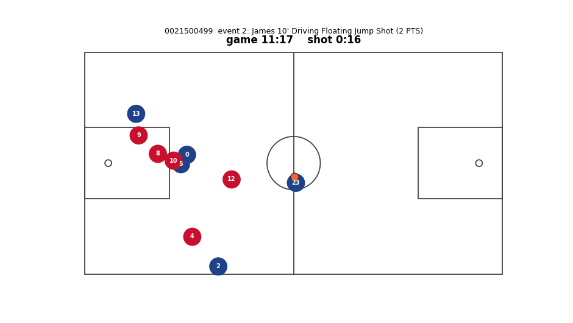

# PLOT — Points Left On the Table

> chess.com's post-game review, but for NBA possessions.

At every instant of a possession there is an **eval bar** — the expected points right now.
For each ball-handler decision (pass / drive / shoot), **PLOT** measures **regret**: the gap
between the best genuinely-available option and the one the player chose. Regret = points left
on the table.

This repository contains three deliverables built on one spine:

1. **Value layer** — an open, reproducible per-action expected-points model for NBA possessions
   (a "VAEP-for-basketball"), from public player + ball tracking.
2. **PLOT metric** — decision regret, valued against the distribution of genuinely-available
   alternatives, aggregated to a per-player *points left on the table*.
3. **Live demo** — an animated, chess.com-style possession review (Next.js).

An accompanying arXiv preprint documents the value layer + PLOT with calibration, validation,
and honest limitations.

> **Status:** early. Built on the only frozen public tracking season (2015-16 SportVU).

## Proof of life (Stage 1)

A possession rebuilt from raw 2015-16 SportVU tracking — 10 players + ball on the court with the
game/shot clock. The eval bar and per-decision regret overlay come in later stages.



## Eval bar (Stage 2) — Gate G1: PASS

The **eval bar** predicts per-moment EPV (expected points the possession will yield) and reads it
off a multiclass outcome head over points `{0,1,2,3}` as `EPV = Σ_k k·P(points=k)`. Both models are
validated under leave-one-game-out cross-validation on held-out **games**, with the identical
calibration code and quarantine — so the upgrade below is an apples-to-apples comparison.

- **Baseline (LightGBM, location/context prior).** Coarse per-frame features (canonical ball
  geometry, region, clocks, score margin, paint counts, ball-handler pressure). Well calibrated:
  calibration-in-the-large **+0.006**, ECE **0.054** pts, beats a constant-rate baseline on log-loss,
  Brier, and the ordinal RPS. Deliberately decision-insensitive. Report: [`reports/G1/`](reports/G1/README.md).
- **Sequence upgrade (PyTorch, full ten-player tracking).** A permutation-invariant DeepSets set
  encoder over the ten players → a **causal** GRU over the 10 fps sequence → the same outcome head.
  It beats the baseline on every proper score — log-loss **0.819 vs 1.014**, Brier **0.461 vs 0.570**,
  RPS **0.428 vs 0.545** — and tightens the calibration slope from 1.15 to **0.96**, while staying
  calibrated (ECE 0.063, cal-in-large −0.012). Report: [`reports/G1_seq/`](reports/G1_seq/README.md).

```bash
uv run python scripts/build_eval_bar_features.py     # cache per-game features (+orientation/QC)
uv run python scripts/train_eval_bar_g1.py           # baseline LOGO calibration -> reports/G1/

uv sync --extra seq                                  # installs torch (MPS/CPU on macOS)
uv run --extra seq python scripts/train_seq_epv_g1.py  # sequence LOGO calibration -> reports/G1_seq/
```

## Per-action value (Stage 3)

The eval bar gives expected points at every instant; the **per-action value layer** turns that into
credit per decision: `value(action) = EPV(end) − EPV(start)` over each on-ball action (a
"VAEP-for-basketball"). Pinning each possession's terminal action to its realized outcome makes the
values **telescope exactly** to `realized − initial EPV` (verified on all 1,774 possessions), and the
credit is sensible — made shots **+0.84**, drawn fouls **+0.15**, passes **≈0**, missed shots
**−0.47**, turnovers **−0.54** (mean ΔEPV). This is the first decision-sensitive signal; the
counterfactual + PLOT regret metric build on it next. Report: [`reports/stage3/`](reports/stage3/README.md).

```bash
uv run --extra seq python scripts/build_action_values.py   # value the actions -> reports/stage3/
```

## Quickstart

```bash
# Python env (pinned to 3.12 via uv)
uv sync          # on macOS, LightGBM needs the OpenMP runtime: `brew install libomp`

# Download one game and verify the data schema
uv run python scripts/download_data.py --tier T0

# Tests
uv run pytest
```

See [`DATA.md`](DATA.md) for data sources, provenance, and the data-availability/ethics stance.

## Layout

```
src/plot/
  io/             # loaders + internal-schema adapter
  possessions/    # possession segmentation + action extraction
  features/       # feature engineering
  models/
    eval_bar/        # EPV (expected possession value): baseline -> sequence model
    action_value/    # per-action value = ΔEPV (VAEP-analog)
    counterfactual/  # xPoints + counterfactual valuation
    regret/          # the PLOT metric
  viz/            # matplotlib prototype animation
  eval/           # calibration, reliability, gate tests
scripts/          # data download, possession build, demo export
notebooks/        # one validation report per gate (G1–G4)
web/              # Next.js demo app
paper/            # arXiv write-up + figures
tests/            # pytest
```

## Acknowledgements / prior art

- **EPV** — Cervone, D'Amour, Bornn, Goldsberry (arXiv:1408.0777; JASA 2016).
- **VAEP** — Decroos, Bransen, Van Haaren, Davis (KDD 2019); `ML-KULeuven/socceraction`.
- Tracking data and animation reference: `dcayton/nba_tracking_data_15_16`,
  `linouk23/NBA-Player-Movements`.
