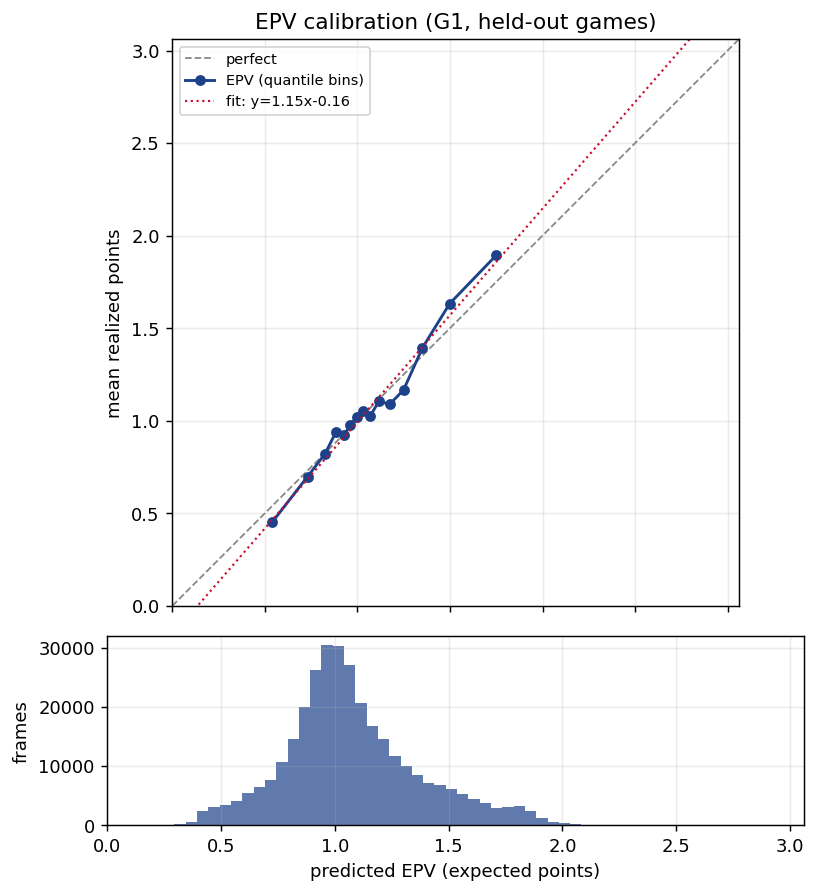
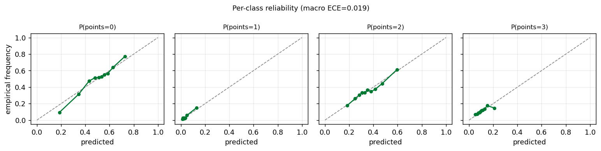

# Gate G1 — baseline EPV ("eval bar") calibration

**Status: PASS.** The Stage-2 baseline eval bar is a per-moment **Expected Possession Value**
(EPV = the points the current offensive possession will ultimately yield). It is a deliberately
**location/context prior** — decision-insensitive and identity-free (no player ids, no shot
quality, no chosen action); the decision-sensitive signal and the PLOT regret metric arrive in
Stage 3+. G1 only asks: *is this forecast calibrated on held-out games?* It is.

## Model
LightGBM **multiclass** head over possession-points outcomes `{0,1,2,3}` (rare 4-point plays
clamped to 3), trained with multiclass log-loss; the scalar eval bar is read off as
`EPV = Σ_k k·P(points=k)`. Features are coarse per-frame context at 10 fps: canonical ball
geometry to the attacked rim, court region, clocks/period, pre-possession score margin, paint
counts, and a single ball-handler→nearest-defender pressure scalar. Each possession contributes
equal total weight (inverse-frame-count weights).

## Evaluation
**Leave-one-game-out (LOGO)** cross-validation with **out-of-fold pooling**: each game is held
out exactly once (group = whole game, never a moment — moments within a possession share one
label and are massively autocorrelated), with a grouped inner watch game for early stopping. All
metrics are computed on the pooled OOF predictions; CIs are a **game-block bootstrap**.

## Headline numbers (pooled OOF, 10 clean games, 321,817 moments / 1,774 possessions)

| metric | value | gate |
|---|---|---|
| calibration-in-the-large (mean EPV − mean points) | **+0.006** (1.079 vs 1.085) | ✅ \|·\|<0.05 |
| ECE (points) | **0.054** CI[0.039, 0.096], MCE 0.144 | ✅ <0.10 |
| macro classwise ECE | 0.019 | — |
| log-loss vs constant baseline | **1.014 < 1.086** | ✅ beats |
| Brier vs baseline | **0.570 < 0.615** | ✅ beats |
| RPS (ordinal) vs baseline | **0.545 < 0.597** | ✅ beats |
| moment slope (diagnostic, not a gate) | 1.152 CI[1.05, 1.31] | CI mildly excludes 1.0 |

The model beats a trivially-calibrated constant predictor on all three strictly-proper scores
(it adds real sharpness, not just calibration-in-the-mean), and the reliability bins track the
diagonal. The EPV-by-region ordering is correctly monotonic with rim proximity
(restricted-area ≈ 1.48 > paint ≈ 1.37 > arc/mid ≈ 1.05 > backcourt ≈ 0.76).




**Slope caveat (honest):** the moment-level slope is 1.15 with a bootstrap CI that *mildly
excludes* 1.0 — the baseline is slightly over-spread (extreme EPVs a touch too extreme). This is
reported as a diagnostic, **not** a gate; the Stage-2 sequence-model upgrade should tighten it.
The possession-level slope-by-mean-EPV (~2.8, in `g1_calibration.json`) is an expected artifact
of averaging a whole trajectory (early backcourt frames shrink the mean), **not** a calibration
failure — the per-moment forecast is the calibrated quantity.

## Data quality / quarantine (4 of 14 games excluded)
SportVU moment buffers bleed ~2.7× across adjacent events, and the tracking `game_clock` is
offset from PBP `PCTIMESTRING` by a large, variable amount (~25 s), so frames are labeled by the
event in which they sit most *centrally* (the bleed lives at buffer edges) and inherit that
event's possession. Coordinates are canonicalized so the offense always attacks the right rim,
via a per-(team, half) attacked-rim map inferred from deep-frontcourt ball position (anchored on
the most decisive cell and propagated by physics, requiring corroboration). Games that cannot be
oriented confidently, or whose canonical backcourt fraction exceeds 0.40, are **quarantined**:

| quarantined | reason |
|---|---|
| 0021500064 (ORL@HOU), 0021500077 (LAL@BKN), 0021500384 (OKC@CLE) | no confident orientation cell |
| 0021500499 (ORL@CLE) | single confident cell, no corroboration |

`0021500499` is the LeBron proof-of-life game; it is excluded from the **EPV training corpus**
only — the demo can still render it event-scoped. Recovering the heavy-bleed games (per-game
flip detection / tracking-only re-segmentation) is tracked as future work.

## Reproduce
```bash
uv run python scripts/build_eval_bar_features.py     # cache per-game feature parquets + QC
uv run python scripts/train_eval_bar_g1.py           # LOGO CV -> this report
uv run pytest -q                                     # 39 tests
```
Artifacts: `g1_calibration.json` (all metrics + CIs + per-fold info), `g1_games.json` (per-game
orientation + cleanup + quarantine), `g1_reliability.png`, `g1_per_class.png`. Hyperparameters
live in `configs/default.yaml` (`eval_bar:` block).
