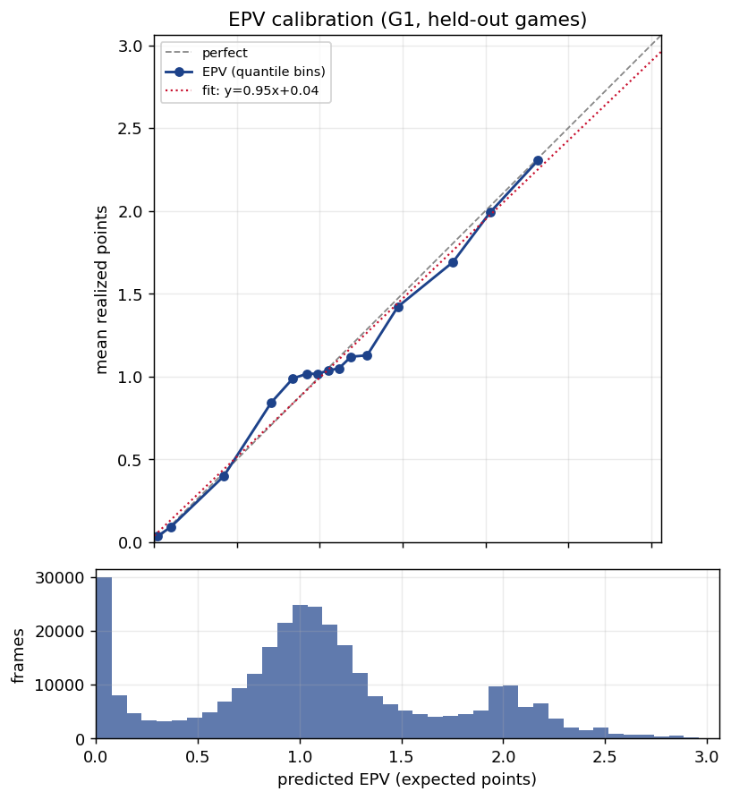
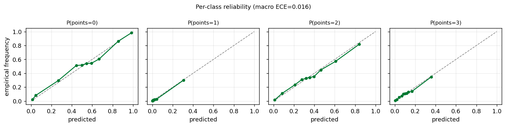

# Gate G1 (sequence model) — EPV "eval bar", upgraded

**Status: PASS — and a decisive upgrade over the LightGBM baseline.** This is the Stage-2
*sequence* eval bar: a per-moment Expected Possession Value read off a model that sees the full
ten-player configuration and its motion, not just where the ball is. It is evaluated under the
**identical** protocol as the baseline (same 10 clean games, same leave-one-game-out pooling, same
quarantine, same `src/plot/eval/calibration.py`), so the head-to-head below is apples-to-apples.

## Model
A **per-frame permutation-invariant set encoder → causal GRU → multiclass outcome head**:

1. **Set encoder (DeepSets).** At each ~10 fps frame, the up-to-ten player tokens — canonical x/y,
   offense/defense/ball-handler flags, distance to the ball — pass through a shared MLP and are
   pooled *separately over offense and defense* (masked mean **and** max). The pooling is symmetric
   in the players, so the frame embedding is invariant to player ordering (verified in tests).
2. **Frame embedding.** The pooled set vector is concatenated with the ball token (position, height,
   distance/angle to the rim) and a context vector (clocks, period, pre-possession margin, clutch)
   and projected down.
3. **Temporal model.** A **unidirectional (causal) GRU** consumes the frame-embedding sequence; the
   hidden state at frame *t* depends only on frames ≤ *t*, so the per-frame EPV trace never leaks
   the future (verified: perturbing frame *t* leaves every earlier frame's prediction bit-identical).
4. **Outcome head.** A linear layer at every timestep produces a distribution over possession points
   `{0,1,2,3}`; the scalar eval bar is `EPV = Σ_k k·P(points=k)`, the same reduction and target as the
   baseline. Per-frame multiclass cross-entropy, each possession weighted to contribute equal total
   weight (1 / frames). PyTorch; trained on Apple MPS, ~25 min for all ten LOGO folds.

## Headline (pooled out-of-fold, 10 clean games, 314,200 moments / 1,774 possessions)

| metric | **sequence** | baseline | gate |
|---|---|---|---|
| log-loss vs constant baseline (1.086) | **0.819** | 1.014 | ✅ beats (−19% vs baseline) |
| Brier vs baseline (0.615) | **0.461** | 0.570 | ✅ beats (−17%) |
| RPS (ordinal) vs baseline (0.597) | **0.428** | 0.545 | ✅ beats (−21%) |
| calibration-in-the-large (mean EPV − mean pts) | **−0.012** (1.097 vs 1.085) | +0.006 | ✅ \|·\|<0.05 |
| ECE (points) | **0.063** CI[0.047, 0.092], MCE 0.158 | 0.054 | ✅ <0.10 |
| macro classwise ECE | 0.016 | 0.019 | — |
| moment slope (diagnostic, not a gate) | **0.955** CI[0.92, 0.99] | 1.152 | dist-from-1 0.045 vs 0.152 |

The sequence model beats the location-only baseline on **all three strictly-proper scores by a wide
margin** — it adds genuine *sharpness*, not just calibration-in-the-mean. The reliability bins now
span a predicted-EPV range of **0.02 → 2.31** (the baseline only resolved 0.54 → 1.75) while still
tracking the diagonal: the model confidently drives EPV toward 0 on dead possessions and above 2 on
high-quality looks, because it can see a step-by-step driving lane or a collapsing double-team that
the per-frame ball location alone cannot express.




**Slope (honest, diagnostic — not a gate).** The moment slope tightened from the baseline's 1.152 to
**0.955** — distance-from-1 cut by two-thirds, exactly the Stage-2 goal. Its bootstrap CI [0.92, 0.99]
now *mildly* excludes 1.0 on the low side (the sharpened forecast is a touch over-spread, the opposite
and smaller of the baseline's under-spread). It remains comfortably inside the 0.8–1.25 tolerance band
and is reported as a diagnostic, not a gate. The possession-mean slope also improved (2.79 → 1.66).

## Robustness notes (honest)
- **Early-stopping floor.** Each fold early-stops on a single inner-validation game. One game's
  per-frame logloss can bottom out after a single epoch by chance; without a guard that fold froze a
  1-epoch model and crippled its held-out predictions. A `min_epochs = 5` floor on best-epoch
  selection fixes it: every fold now keeps a model from epoch **17–39** (the formerly-fragile
  `0021500341` went from best-epoch 1 / val 1.03 to best-epoch 34 / val 0.84). A pooled multi-game
  inner-validation set would smooth this further and is noted as future work.
- **Frame coverage (314,200 vs the baseline's 321,817 moments).** Possessions exceeding `max_frames`
  = 320 (~32 s — almost all boundary-merge artifacts longer than a 24 s shot clock) are capped to
  their most recent 320 frames at both train and inference. The dropped ~2.4 % are low-information
  early-backcourt frames of mislabeled merges; the comparison stays on the identical ten games.

## Data quality / quarantine
Unchanged from the baseline — same orientation inference, same central-event de-bleed, same
backcourt-fraction QC, same `data/processed` cache (re-validated on load). 4 of 14 local games are
quarantined identically (`0021500064`, `0021500077`, `0021500384` — no confident orientation cell;
`0021500499` — single confident cell, no corroboration). The sequence corpus reports exactly the
same `clean games: 10 | frames: 321817` before capping. See [`../G1/README.md`](../G1/README.md).

## Reproduce
```bash
uv sync --extra seq                                          # installs torch (MPS/CPU on macOS)
uv run --extra seq python scripts/build_eval_bar_features.py # (optional) prime the shared cache
uv run --extra seq python scripts/train_seq_epv_g1.py        # LOGO CV -> this report
uv run --extra seq python -m pytest -q                       # full suite incl. seq invariants
```
Artifacts: `g1_seq_calibration.json` (all metrics + CIs + per-fold best-epochs + the hyperparameter
block), `g1_seq_games.json` (per-game orientation/quarantine), `g1_seq_reliability.png`,
`g1_seq_per_class.png`. Hyperparameters live in `configs/default.yaml` (`seq_epv:` block).
