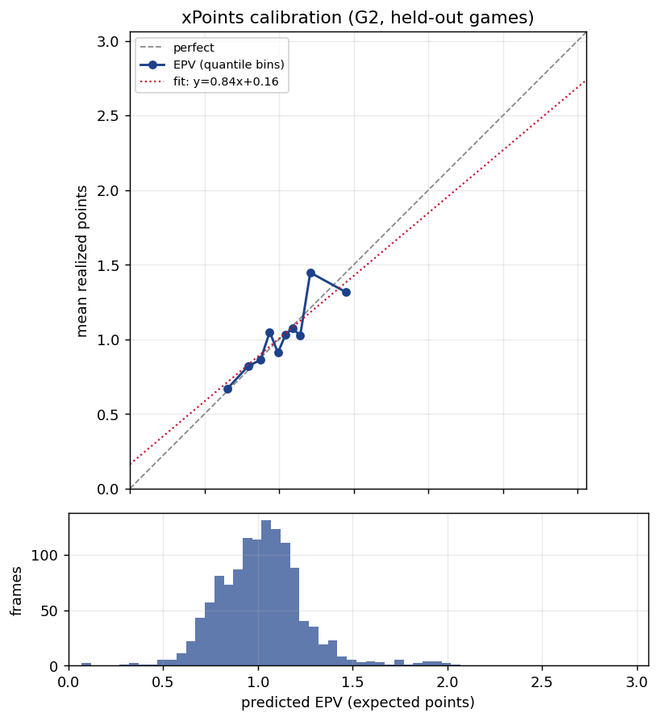
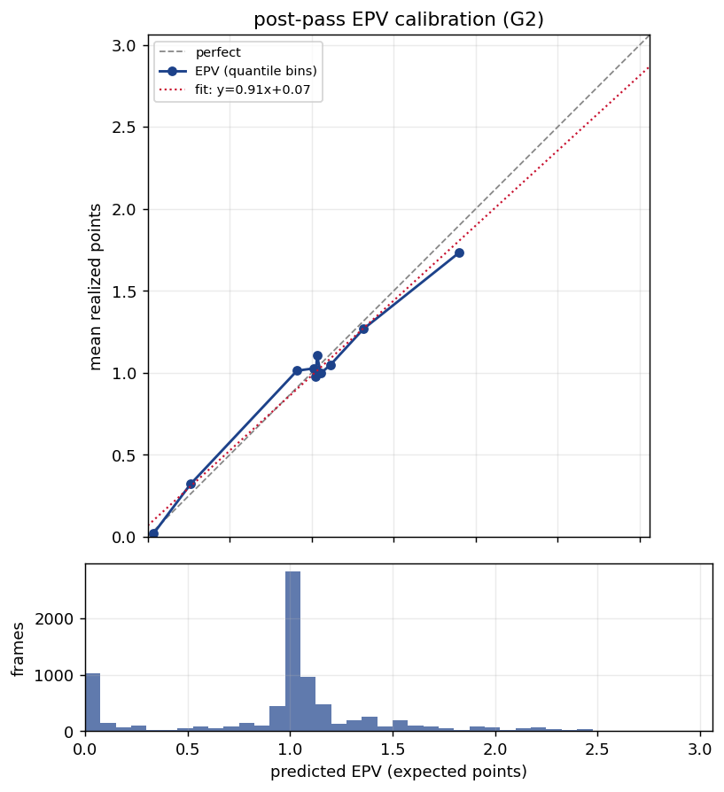

# Gate G2 (the crux) — narrow counterfactual calibration

**Status: PASS.** G2 is the make-or-break gate for PLOT's thesis. Decision **regret** =
`xPoints(best available open shot) − value(chosen action)` is only meaningful if its two inputs
are calibrated one step ahead, on **held-out** continuations. If they are not, regret is an
artifact and we stop and fix before going further. They are.

## What regret needs, and what G2 checks
At each on-ball decision the ball-handler could shoot now; regret compares that option to what they
actually did. Two model quantities feed it, each validated here on held-out data:

1. **xPoints** — the expected points of shooting now (`P(make) × points`), the well-identified
   counterfactual: a logistic fit on REAL observed shots (location, openness, 2-vs-3), so "what is
   this open shot worth?" needs no rollout. **G2 check:** when a shot WAS taken, does xPoints match
   the realized field-goal points (leave-one-game-out)?
2. **post-pass EPV** — the value credited to a chosen *pass* (the locked "expected, not realized"
   basis): the sequence eval bar at the receiver's catch, read from the **leakage-free** out-of-fold
   EPV trace. **G2 check:** when a pass WAS made, does that EPV match the realized possession points?

## Results (10 clean games)

| check | n | cal-in-large | ECE (pts) | slope | beats baseline | gate |
|---|---|---|---|---|---|---|
| **xPoints** (LOGO held-out shots) | 1,233 | **+0.002** (xP 1.018 vs fg 1.020) | **0.077** | 0.84 | log-loss 0.668 < 0.689 | ✅ |
| **post-pass EPV** (OOF, recalibrated) | 8,076 | **−0.014** (0.970 vs 0.955) | **0.066** | 0.92 | — | ✅ |

Both reliability curves track the diagonal: xPoints bins run 0.68→0.70 … 1.41→1.40; post-pass EPV
bins 0.04→0.02 … 1.81→1.66. The shot sample itself is realistic — **47% FG, 26% threes, mean 1.02
points per attempt, make-rate falling with distance** (rim 0.62 → mid 0.46 → three 0.41), and ~73%
of PBP field-goal attempts are localized (anchored on each shot's own PBP event, release =
last frontcourt frame the shooter holds the ball).




## EPV recalibration (honest)
The raw sequence EPV is calibrated overall (G1) but slightly **over-spread** at the dynamic catch
states the counterfactual reads (slope 0.83, ECE 0.125 — tails too extreme, average fine). A
**fold-safe isotonic recalibration** (`counterfactual/calibrate.py`: EPV → expected points, fit
leave-one-game-out, monotone so it preserves G1's ranking) pulls the tails onto the diagonal — slope
0.83 → 0.92, ECE 0.125 → 0.066 — without touching cal-in-large. The recalibrated `epv_cal` is what
post-pass values and regret consume.

## Regret (demonstration — the metric arrives in Stage 5)
With both inputs calibrated, the v1 narrow regret is computed at open-handler **pass** decisions
(`best_available` = the wide-open shot's xPoints; `chosen` = post-pass EPV): **5,525 decisions over
159 players**, mean clipped regret **0.075**, mean signed **−0.263** (most passes *improve* on a
contested-spot open shot — exactly what good ball movement should do), 28% of decisions show
positive regret, p90 clipped 0.21. Per-player aggregation, the finishing/location controls, and the
split-half stability gate (G3) are **Stage 5**; this is only the per-decision machinery.

## Limitations carried forward
- **Narrow available set (v1 = open shot only).** Open teammates and drives are added only after G2
  holds (it does); generative rollouts remain out of scope.
- **Shot localization recall ~73%** (unbiased: the located sample's FG% matches reality); shooter
  identity is not yet an xPoints feature (sparse at 10 games) — both are expansions, not blockers.
- The chosen-pass value is the post-pass EPV, not a full rollout; this is the locked one-step design.

## Reproduce
```bash
uv sync --extra seq
uv run --extra seq python scripts/build_oof_epv.py        # leakage-free OOF EPV trace (+ epv_cal)
uv run --extra seq python scripts/train_xpoints_g2.py     # -> this report
uv run python -m pytest tests/test_counterfactual.py -q   # shots / xPoints / regret / recalibration
```
Artifacts: `g2_calibration.json` (xPoints + post-pass blocks, reliability bins, the gate),
`g2_xpoints_reliability.png`, `g2_postpass_epv_reliability.png`. The OOF EPV trace is cached at
`data/processed/oof_epv_trace.parquet` (gitignored).
