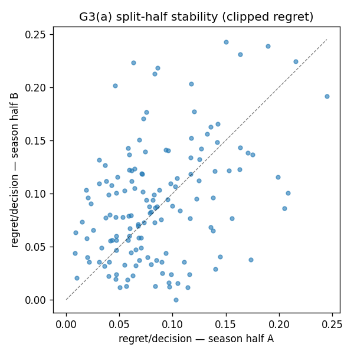
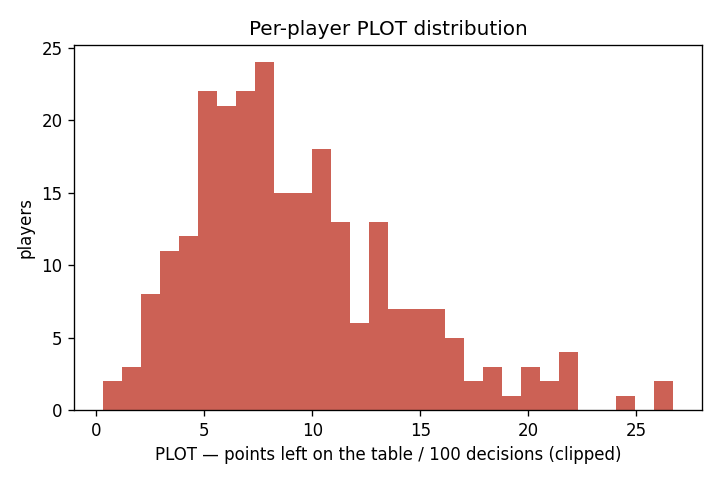

# Gate G3 — the PLOT metric is a stable skill, distinct from finishing

**Status: PASS.** Stage 5 turns per-decision regret into the flagship per-player metric — *points
left on the table* per 100 decisions — and G3 asks the two questions that decide whether that metric
is real: does it **repeat** (a skill, not noise), and is it **distinct from finishing** (a decision
property, not just shot-making or court location)? Both hold.

## What G3 checks
Per-decision regret (`xPoints(open shot here) − post-pass EPV`, on the leakage-free recalibrated
trace) is aggregated per player. Three statistics, over **24,478 open pass-up decisions** in 42 clean
games (358 players; **249** clear the ≥30-decision bar to enter the metric):

1. **G3(a) — stable.** Split the season's games odd/even (so neither half is a contiguous date
   block), aggregate per player within each half, and correlate. A skill repeats across independent
   samples; noise does not.
2. **G3(b-i) — decision, not location.** A nested OLS: `regret ~ shot-location controls`, then add
   **player fixed effects**. An F-test asks whether players differ in regret for reasons location
   (distance, distance², 3-pt, openness) alone cannot explain.
3. **G3(b-ii) — decision, not finishing.** xPoints uses a *population* make model (no shooter
   identity), so regret should be orthogonal to a player's finishing skill. We verify it: per-player
   regret vs finishing residual (`made − population P(make)` on their real shots).

## Results

| check | statistic | verdict |
|---|---|---|
| **G3(a) split-half stability** (clipped, n=143 players in both halves) | Pearson **0.384** (p=2e-6), Spearman 0.321, **Spearman–Brown full 0.555** | ✅ stable |
| &nbsp;&nbsp;— signed regret | Pearson 0.334 (p=5e-5), SB-full 0.501 | ✅ |
| **G3(b-i) player FE beyond location** | F(249, 24224) = **3.35, p≈0**; R² 0.259 → 0.284 (incremental **0.025**) | ✅ not just location |
| **G3(b-ii) regret vs finishing** (n=184) | Pearson **−0.037** (p=0.62), Spearman −0.015 | ✅ not finishing |




**Reading it.** A player's tendency to leave points on the table by passing up open looks **repeats**
across independent halves of the season (r=0.38; Spearman–Brown-corrected full-sample reliability
0.55) — moderate but decisively non-zero for a behavioral metric on a half-season. That repeatable
component is **not** explained by where the shots come from (player fixed effects are jointly
significant beyond the full location model), and it is **orthogonal to finishing skill** (−0.04) —
exactly as the population-xPoints construction intends. So PLOT measures a *decision* attribute.

## The metric (v1 narrow)
`PLOT = points left on the table / 100 decisions`, evaluated at open ball-handler **pass** decisions:

- **mean clipped regret 0.084 pts/decision (8.4 / 100)**; signed **−0.241** (passing usually *beats*
  the contested-spot open shot — good ball movement, consistent with G2), 34% of decisions show
  positive regret, p90 clipped 0.195, max 1.29.
- The per-player table (`data/processed/plot_per_player.parquet`) ranks players by clipped PLOT; the
  top of the board leaves ~20–27 points/100 on the table by passing up open looks, the bottom ~0–3.

## Honest limitations
- **v1 evaluates ONE decision type:** an *open* handler (nearest defender ≥ 4 ft) passing up the
  shot. It does not yet score drives or open-teammate passes, so the headline is "value left by
  passing up open looks," not all decisions. (Locked v1 scope; expansion is the next step.)
- **The signed metric has a noisy left tail** — a few players show implausibly large *negative*
  signed regret on small samples (one at −1.02/decision over 38 decisions, dominated by a handful of
  near-made post-pass continuations). The **clipped** headline is the robust one and is what the
  stability gate uses; signed is reported as a diagnostic.
- **Decision-level incremental R² is small (2.5%).** Single decisions are noisy; the signal lives at
  the player-*average* level — which is precisely the quantity that is stable in G3(a). We therefore
  gate on player-level stability, not decision-level fit. The F-test confirms the player component is
  real; the split-half correlation confirms it is repeatable.
- **Reliability is moderate (0.38; 0.55 SB-corrected), not high.** More games would tighten it; the
  43% orientation quarantine currently caps the corpus at 42 of 74 downloaded games.

## Reproduce
```bash
uv sync --extra seq
uv run --extra seq python scripts/build_oof_epv.py --kfold 7   # leakage-free OOF EPV trace over 42 games
uv run --extra seq python scripts/build_plot_g3.py             # -> this report
uv run python -m pytest tests/test_plot_metric.py -q           # aggregation / stability / FE / gate
```
Artifacts: `g3_stability.json` (distribution, leaderboard, the three G3 blocks, the gate),
`g3_split_half_scatter.png`, `g3_plot_distribution.png`, and the per-player metric at
`data/processed/plot_per_player.parquet` (gitignored). The OOF EPV trace is built with **group
k-fold** (leakage-free, scales past LOGO's one-training-per-game) and cached at
`data/processed/oof_epv_trace.parquet` (gitignored).
