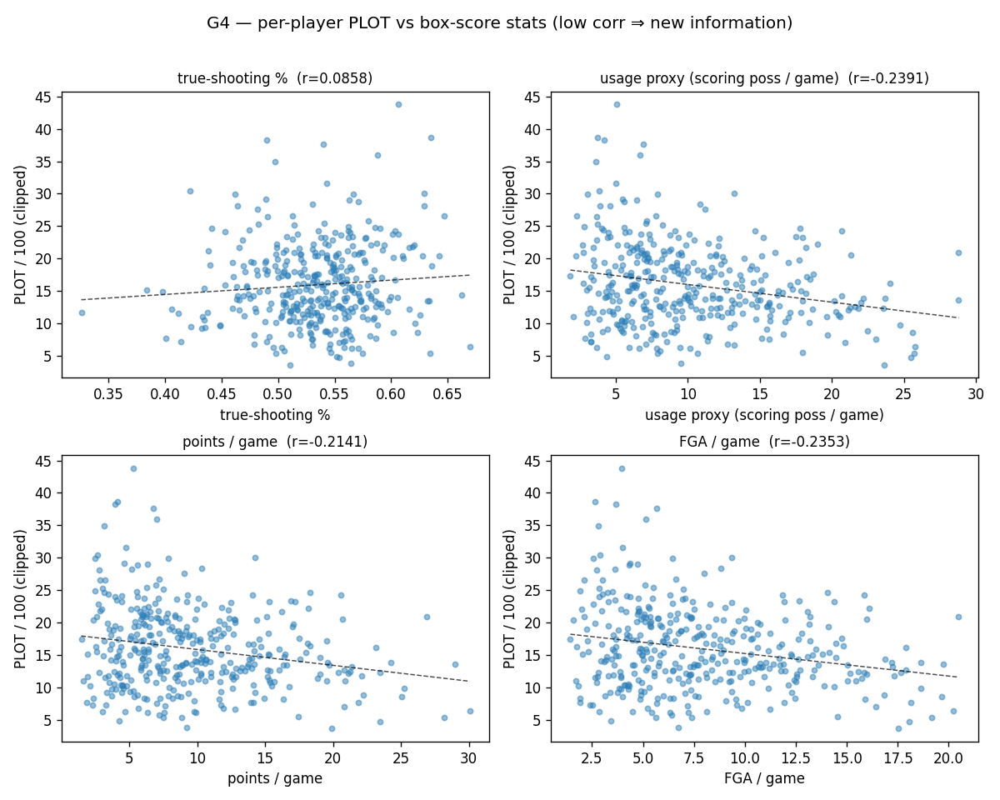

# Gate G4 — the PLOT metric is *new information*, not box-score efficiency relabeled

**Status: PASS.** Stage 6 takes the per-player headline — *points left on the table / 100 open
pass-up decisions* — and asks the question every new basketball number must survive: **isn't this
just shooting efficiency (or volume, or scoring) with extra steps?** It has two parts, and both
hold: PLOT is **largely orthogonal to the box score** (it carries information TS% / usage / scoring
cannot reconstruct) and it **repeats across the season** (the reliability already shown in G3a).

## What G4 checks
Per-player PLOT (`plot_per100_clipped`, from `data/processed/plot_per_player.parquet`, the 208-game
run) is correlated against season-long box stats computed from play-by-play — points are taken from
event semantics (made FG = 2, +1 if the description says "3PT"; made FT = 1), never the
orientation-inconsistent SCORE column, same as segmentation:

1. **Incremental information.** Low `|corr(PLOT, box stat)|` against the quantities PLOT could be
   confused for — **true-shooting %** (efficiency), a **usage proxy** (scoring possessions per
   game), **points / game**, **FGA / game** — plus a joint OLS asking how much of PLOT's variance
   the box score reconstructs at all.
2. **Reliability.** The metric must repeat across independent samples. **Reused from G3(a)**
   (split-half 0.51, Spearman–Brown 0.68) rather than recomputed — the per-decision regret for the
   208-game run is not local. A signal that is *both* reliable *and* distinct from the box score is,
   by definition, new information.

**Gate (pre-registered):** every gated `|Pearson|` < **0.50** *and* Spearman–Brown reliability ≥
**0.60**. Box-stat inclusion requires ≥ 50 true-shooting attempts (FGA + FTA) for a stable rate.

## Results (374 of 380 PLOT players matched to box stats)

| comparator | Pearson (clipped PLOT) | Spearman | verdict |
|---|---|---|---|
| **true-shooting %** (efficiency) | **+0.086** (p=0.10, n.s.) | +0.067 | ✅ unrelated to finishing efficiency |
| **usage proxy** — scoring poss / game | **−0.239** (p=3e-6) | −0.194 | ✅ weak, well under 0.50 |
| points / game | −0.214 (p=3e-5) | −0.167 | ✅ |
| FGA / game | −0.235 (p=4e-6) | −0.189 | ✅ |
| **joint OLS — box stats → PLOT** | **R² = 0.076** (adj 0.066, all four) | | ✅ ~92% of PLOT is *not* box score |
| **reliability** (G3a, reused) | split-half **0.514**, Spearman–Brown **0.679** | | ✅ repeats |



**The headline is real and distinct.** TS% — the obvious "isn't this just good shooters?" — is
**essentially uncorrelated** with PLOT (+0.086, not significant; signed metric +0.02). A joint
regression on all four box stats explains only **7.6%** of per-player PLOT variance, so the metric
is overwhelmingly *not* reconstructable from the box score. Paired with the G3a reliability, PLOT is
a repeatable signal the box score is structurally blind to — exactly the project's thesis.

## The leaderboard (and what the usage correlation means)
The weak **negative** usage/volume correlation is not noise — it is a legible *role* pattern:

- **Most points left on the table:** Miles Plumlee (43.8/100), Montrezl Harrell, Kosta Koufos,
  Willie Cauley-Stein, Hassan Whiteside, Adreian Payne — **rim-running bigs and role players** who
  get open looks and pass them up.
- **Least:** John Wall (3.6/100), Russell Westbrook, Kevin Durant, Bradley Beal, Ramon Sessions —
  **high-usage primary scorers** (usage proxy 18–26/g) who, when open, take the shot.

So PLOT v1 partly tracks who *defers* an open look. That is face-valid (a center kicking out an open
18-footer leaves expected points behind) and it is *why* usage correlates −0.24 — but it is also a
**caveat**, not just a triumph: see limitations.

## Honest limitations
- **The usage correlation is weak but genuinely non-zero** (−0.24 clipped, −0.34 signed; p≈1e-6).
  Higher-usage players leave slightly *less* on the table. It clears the incremental-info bar by a
  wide margin (≈6% shared variance) — PLOT is not a usage proxy — but the paper should report this
  directional relationship, not claim independence.
- **PLOT v1 is role-structured** (bigs high, lead guards low). This is the open question G4 does
  *not* settle: is a big passing up an open mid-range shot a *bad decision* (points left behind) or
  *correct deference* to a better offense? G4 proves PLOT is **new** information; it does **not**
  prove that information is **decision quality**. That is the validity gap (does high PLOT = actually
  worse outcomes?), still open, and v1 scores only *one* decision type (an open ≥4 ft handler passing
  up the shot — not drives, not teammate passes, not shot selection).
- **BPM is not yet a comparator.** The "overall value" composite (a weighted box-score sum) is the
  one box metric not computed here — it needs an external advanced-stats table + a name→id join.
  Since TS% (its efficiency component) is ~0 and usage/scoring are weak, BPM is expected to be weak
  too, but this is asserted, not shown. Adding real BPM/USG% is a clean next step.
- **Window mismatch.** Box stats are **season-long**; PLOT is from the **208 tracking games**
  (2015-10-27 .. 2016-01-23). The 208-game id list is not local and a player's efficiency/usage
  reputation is conventionally season-long, so this is the reproducible comparator — but it is not a
  same-sample comparison.
- **6 of 380 PLOT players dropped** for < 50 season FGA+FTA — low-volume passers (few attempts,
  relatively high PLOT). They sit on the negative usage trend, so including them would, if anything,
  make the usage correlation slightly *more* negative — the reported value is conservative.

## Reproduce
```bash
uv run python scripts/build_g4.py                          # -> this report + data/processed/plot_box_stats.parquet
uv run python -m pytest tests/test_box_stats.py -q         # box-stat math / correlations / gate
```
Artifacts: `g4.json` (thresholds, the four correlations clipped + signed, joint variance explained,
reliability reused from G3a, leaderboard, the gate), `g4_plot_vs_box.png`, and
`data/processed/plot_box_stats.parquet` (gitignored — season-long per-player box stats).
