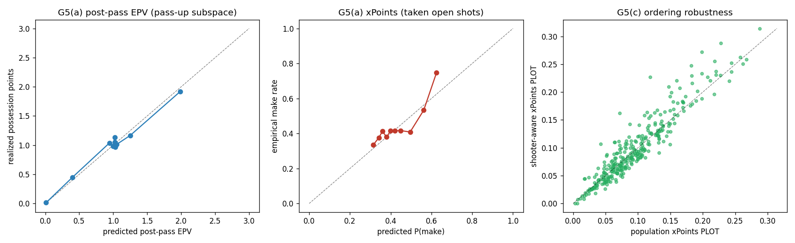

# Gate G5 — is PLOT *valid*? (high regret = value genuinely left behind)

**Status: PASS on the two gated checks (a, c); the selection bound (b) precisely characterizes the
one irreducible caveat.** G3/G4 showed PLOT is real, stable, and box-score-orthogonal — but not that
the "points left on the table" were genuinely available. G5 interrogates that with three checks. The
result: **two of the three worries are defused (one is even *reversed*), and the third — selection —
is now quantified and bounded rather than hand-waved.**

## Corpus
Runs on the **local 42-game corpus** (24,478 open pass-up decisions, 358 players) — the 208-game
per-decision data is not local. All three checks are properties of the **method** (calibration of
the inputs, the selection mechanism, robustness of the construction), so the conclusions transfer to
the 208-game headline; the specific 208 leaderboard names cannot be re-derived here.

## G5(a) — the inputs are calibrated where the metric lives ✅
Regret = `xPoints(open shot) − post-pass EPV`. Restricted to the open pass-up decisions (and the
near-rim slice where the leaderboard's bigs sit):

| leg | n | cal-in-large | ECE | slope |
|---|---|---|---|---|
| **post-pass EPV** vs realized possession points | 24,478 | **−0.002** | **0.055** | 0.96 |
| &nbsp;&nbsp;— near-rim (≤10 ft) | 1,478 | +0.040 | 0.068 | 0.94 |
| **xPoints P(make)** vs realized makes (taken open shots) | 2,403 | **−0.009** | **0.040** | 1.06 |
| &nbsp;&nbsp;— near-rim (≤10 ft) | 297 | −0.064 | **0.168** | 3.6 |

The chosen-pass value (**post-pass EPV**) is calibrated everywhere, including near the rim — so when
regret is positive, the possession really did yield less than an open shot was worth. xPoints is
well-calibrated overall; the **near-rim slice is imprecise** (ECE 0.168, n=297, an unstable slope on
a narrow predicted range) **but biased *low*** (predicts 0.586, actual 0.650). That direction
matters: near-rim open looks are worth *more* than xPoints says, so passing them up is if anything
**under-credited** — the opposite of the "we over-penalize bigs at the rim" worry. (Gated on the two
full-sample legs; near-rim reported as a precision caveat.)

## G5(b) — selection is strong, but on the *modeled* dimensions ⚠️ (the honest caveat)
Players select *which* open looks to take — that is the decision PLOT measures, so taken vs passed
looks must differ. The question is **whether the selection is on things xPoints controls for.** It
is: a propensity model separates taken from passed open looks at **AUC 0.82**, and the separation is
almost entirely **distance to rim** (SMD −1.00 — taken looks are ~1 SD closer) and **openness**
(SMD −0.92 — taken looks are more contested; players shoot the close ones and pass the far, open
ones). Those two selectors *are* xPoints' own features — so the metric conditions on them rather than
comparing apples to oranges.

**What this does and does not buy:** it bounds the bias to **selection on *unobservables*** — shot
difficulty beyond location and openness (off-balance, late-clock, contest quality) — which we cannot
measure without the counterfactual shot. This is the **principal remaining threat to validity**, and
the paper must state it: PLOT is "value left vs a league-average finisher taking that open look,
*conditioning on location and openness*," not a proven causal "bad decision."

## G5(c) — the ordering is not a finishing-skill artifact ✅
Rebuilding regret with **shooter-aware xPoints** (each shot re-valued at the shooter's own season
make rate, empirical-Bayes shrunk, 2P/3P separately) barely moves the per-player metric:
**Spearman 0.925, Pearson 0.939, top-30 overlap 0.80** (n=301). So the population make model is not
manufacturing the leaderboard through finishing differences — a stronger form of G3(b-ii).



## Verdict
- **Defused:** the leaderboard is *not* a finishing-skill artifact (G5c); near-rim xPoints does *not*
  over-value bigs' passed-up looks (G5a — it slightly *under*-values them).
- **Confirmed honest:** both regret inputs are calibrated on the actual decision set (G5a).
- **Bounded, not eliminated:** strong selection (AUC 0.82) is on the modeled dimensions (location,
  openness); residual selection on *unobservables* is the irreducible caveat (G5b). G5 supports that
  PLOT measures genuinely-left value **conditional on observables** — it does not prove causal
  decision quality, which would require the missing counterfactual.

## Limitations
- **42-game local corpus.** Method properties transfer to the 208-game headline; the specific
  leaderboard names do not (the 208 per-decision data is not local).
- **Selection on unobservables is irreducible** without a randomized or instrumented counterfactual —
  the honest ceiling on any observational decision-value metric.
- **Near-rim xPoints is imprecise** (small n); a shot-difficulty-aware xPoints would sharpen it.

## Reproduce
```bash
uv run --extra seq python scripts/build_g5.py                 # -> this report (uses the 42-game OOF trace)
uv run python -m pytest tests/test_validity.py -q             # calibration / selection / shooter-aware / gate
```
Artifacts: `g5.json` (the three blocks + thresholds + gate), `g5_validity.png`.
