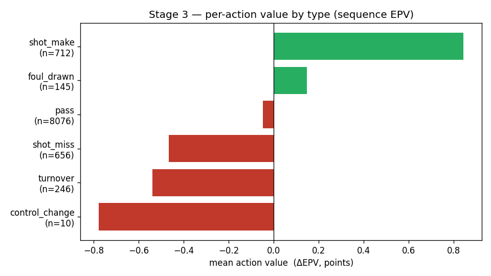

# Stage 3 — per-action value layer (ΔEPV) + decomposition check

**Status: built and validated.** This is PLOT's "VAEP-for-basketball": every on-ball action is
valued by how much it changed the expected possession value,

> **value(action) = EPV(end) − EPV(start)**,

read off the Stage-2 sequence eval bar. It is the first *decision-sensitive* signal in the project
(the eval bar alone is a location/configuration prior); the counterfactual and the PLOT regret
metric build on it in Stages 4–5.

## Actions
On-ball actions are grounded in the one signal tracking gives reliably — **who has the ball**. Per
~10 fps frame the ball-handler is the offensive player nearest the ball within 6 ft; the id is
forward-filled (so a pass's in-flight frames stay with the *passer*) and back-filled at the start.
A new action begins whenever the handler changes; each contiguous run a player holds the ball is one
action. A non-terminal segment ends because the ball went to a teammate → `pass`; the **terminal**
action of each possession is typed from the segmenter's `end_reason`
(`shot_make` / `shot_miss` / `turnover` / `foul_drawn` / …). See `src/plot/possessions/actions.py`.

## Value + the telescoping decomposition
The terminal action's end-state is pinned to the **realized** outcome (an absorbing state worth the
possession's actual points, clamped to the model's `{0,1,2,3}`), so the values telescope **exactly**:

```
value(action_k) = EPV(start of action_{k+1}) − EPV(start of action_k)     (non-terminal)
value(terminal) = realized_points            − EPV(start of terminal)     (absorbing)
  ⇒  Σ_k value_k = realized_points − EPV(first frame) = realized − initial
```

The decomposition check verifies this per possession — a regression guard against any
frame-misalignment between the action table and the EPV trace.

## Results (10 clean games, 1,774 possessions, 9,850 actions, 5.55 actions/possession)

**Decomposition telescopes: ✅ exactly.** `max|residual| = 0.0` over all 1,774 possessions, none
excluded for trace gaps.

**Sensibility — mean value by action type** (the substantive validation that the credit is
meaningful, not just internally consistent):

| action type | n | mean ΔEPV | median |
|---|---|---|---|
| `shot_make` | 712 | **+0.84** | +0.82 |
| `foul_drawn` | 145 | **+0.15** | +0.23 |
| `pass` | 8,076 | **−0.05** | −0.02 |
| `shot_miss` | 656 | **−0.47** | −0.17 |
| `turnover` | 246 | **−0.54** | −0.40 |
| `control_change` | 10 | −0.78 | −0.75 |
| `period_end` | 3 | −0.98 | −1.09 |

Scoring actions add expected points; turnovers and missed shots destroy them; the rare possessions
that simply expire or are lost mid-possession are strongly negative. Passes average **≈ 0** with
wide spread (σ ≈ 0.35) — exactly right: most passes are neutral ball-movement, but the distribution's
tails are the good passes (+) and the bad ones (−) that the regret metric will surface. The slight
negative mean on `pass` is the expected EPV decay as a handler works against a setting defense and
the shot clock runs.



## Honest limitations (carried into Stage 4)
- **In-sample EPV trace.** One sequence model trained on all clean games scores those same games —
  fine for a *descriptive* decomposition (telescoping is structural; sensibility is a sign check).
  **Stage 4 (regret) switches to leakage-free out-of-fold traces**, which the LOGO machinery
  already produces.
- **Coarse action typing.** An intermediate missed shot that is offensive-rebounded reads as a
  `pass` to the rebounder (only the *terminal* shot is typed as a shot), and the terminal action is
  attributed to the tracking ball-handler rather than the PBP shooter. Both are refinements; neither
  affects the telescoping decomposition.
- **`max_frames` cap** is not applied to the trace here (uncapped inference), so every action
  boundary has an EPV and trace coverage is 100% (0 possessions excluded).

## Reproduce
```bash
uv sync --extra seq
uv run --extra seq python scripts/build_action_values.py     # -> this report
uv run python -m pytest tests/test_actions.py -q             # action + telescoping tests (no torch)
```
Artifacts: `action_values_summary.json` (counts, value-by-type, decomposition residuals),
`value_by_type.png`; the full valued action table is cached to
`data/processed/action_values.parquet` and the model to `artifacts/seq_epv_full.pt` (both gitignored).
